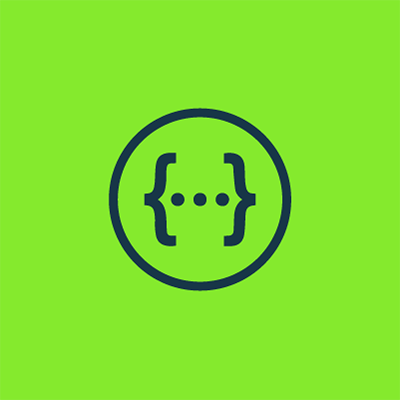

# DESAFIO BGC - BRASIL

O desafio consiste em criar um sistema que retorne os três primeiros produtos de cada categoria da página de mais vendidos da Amazon (https://www.amazon.com.br/bestsellers) e disponibilize essas informações por meio de uma API. Para isso, será necessário implementar um web scraper (utilizando Puppeteer) que extraia os dados e preencha um banco de dados utilizado pela API.

# Sumário

- [Documentação](#documentação)
- [Ferramentas Utilizadas](#ferramentas-utilizadas)
- [Implementação](#implementação)
- [Compilação e Execução](#compilação-e-execução)
- [Considerações finais](#considerações-finais)
- [Contatos](#contatos)

# Documentação

Abaixo estão alguns links importantes para ajudar na compreensão da tarefa e no uso das ferramentas envolvidas:

- [Diário de Bordo](https://docs.google.com/document/d/1eEM56RRZlDFTrcXQE7txQXtcWO5pzMAcksMEC3rvrUc/edit?usp=sharing)  
  Registros detalhados do progresso e das etapas realizadas durante o desenvolvimento.

- [Comandos Úteis](https://docs.google.com/document/d/1CZrg0useXKoIFeijGeDK3NSPSFtjZqvzzm9dakc9J_U/edit?usp=sharing)  
  Lista de comandos essenciais para facilitar a execução das tarefas.

- [Documentação da API](#)  
  Para acessar, inicie a aplicação e acesse `localhost:3000`. Certifique-se de que a porta esteja disponível antes de executar.

- [Vídeo de Exemplificação](#)  
  Um vídeo explicativo sobre como utilizar o sistema e seus principais recursos.

# Ferramentas Utilizadas

  
  
  
  
  

A pedido da BGC, foi utilizado o `Node.js/TypeScript` para o desenvolvimento do back-end, junto com as ferramentas disponibilizadas pela AWS, como o `DynamoDB` para a persistência dos dados, `Lambda` para a execução da função de busca de categorias e o `API Gateway` para a comunicação das APIs. O `Serverless Framework` também foi utilizado para a automação do processo de deploy. Ademais foi utilizado o `Swagger` para documentar a API.

# Implementação

A implementação foi realizada utilizando o Node.js/TypeScript para o desenvolvimento do back-end. O sistema foi responsável por fazer o scraping da página de bestsellers da Amazon utilizando o Puppeteer.

O processo de implementação inclui as seguintes etapas:

1. **Extração de Categorias**: A primeira função do scraper é extrair todas as categorias presentes na página de bestsellers da Amazon, como, por exemplo, "Games e Consoles". 
   
2. **Escolha da Categoria**: Após mapear as categorias disponíveis, o usuário pode escolher uma das opções por meio de uma entrada numérica. Essa escolha define qual categoria será processada em seguida.

3. **Scraping dos Produtos**: Após a seleção da categoria, o Puppeteer faz o scraping novamente para extrair os dados dos três primeiros produtos mais vendidos dessa categoria. As informações extraídas incluem:
   - Nome do produto
   - Link do produto
   - Ranking de vendas
   - Avaliação do produto
   - Preço do produto

4. **Armazenamento no DynamoDB**: Todos esses dados são então armazenados na tabela `ProdutosMaisVendidosPorCategoria` no DynamoDB para posterior consulta via API.

Essa implementação permite que o sistema capture e armazene dados atualizados sobre os produtos mais vendidos em diferentes categorias, tornando as informações facilmente acessíveis por meio da API.

Para a criação e configuração dos Lambdas, utilizei o arquivo `serverless.yml`. Nesse arquivo, configurei as funções Lambda responsáveis pelas tarefas de recuperação de dados. Cada função foi configurada para ser executada de acordo com os eventos disparados.

A função Lambda `find`, localizada no arquivo `get.ts`, foi desenvolvida para realizar a busca dos três produtos mais vendidos pela categoria passada como parâmetro (o `categoryId`). Essa função retorna todas as informações dos produtos armazenadas no banco de dados DynamoDB.

### Detalhes da função Lambda `find`:
- **Parâmetro**: O `categoryId` é passado para a função para que ela saiba qual categoria consultar. (deve ser passada sem acentos)
- **Processo**: A função consulta a tabela `ProdutosMaisVendidosPorCategoria` no DynamoDB.
- **Retorno**: A função retorna as informações armazenadas no banco, incluindo nome, link, ranking, avaliação e preço dos produtos.

Com essa abordagem, a API é capaz de fornecer dados atualizados sobre os produtos mais vendidos em cada categoria, facilitando o consumo por outras aplicações ou serviços.

# Considerações Finais

A experiência foi extremamente enriquecedora, pois me permitiu aprender mais sobre as ferramentas da AWS e me proporcionou a oportunidade de desenvolver uma aplicação que me colocou em um novo nível de domínio de ferramentas. Encontrei diversas dificuldades ao longo do caminho, mas, com tutoriais, pesquisas e trocas de informações, foi possível entregar o que foi solicitado.

Após alguns testes, percebi que 5 das 29 categorias estão apresentando um erro, o qual não consegui solucionar a tempo. Contudo, acredito que com mais tempo e investigação, seria possível resolver esse problema.

Como possíveis melhorias, destaco a redução do tempo de execução do scraping, que acredito estar levando mais tempo do que o esperado. Além disso, um dos meus objetivos era implementar a função POST, permitindo que fosse possível, por meio de um endpoint, realizar a etapa de preenchimento do banco de dados, sem a necessidade de executá-la localmente.

# Compilação e Execução

Para executar o projeto localmente, utilize os seguintes comandos dentro da pasta que contém todos os arquivos do projeto:

| Comando                | Função                                                                                           |                    
| ---------------------- | ------------------------------------------------------------------------------------------------- |
| `npm start`            | Compila e executa todos os arquivos necessários, iniciando o servidor local para testar a aplicação. |
| `serverless deploy`    | Realiza o deploy do projeto utilizando o Serverless Framework, configurando e enviando os recursos para a AWS. |
| `serverless info`      | Exibe informações sobre o deploy, como o endpoint da API e outros detalhes relacionados à configuração do projeto na AWS. |

Certifique-se de ter todas as dependências instaladas antes de executar os comandos, utilizando o `npm install` para garantir que todas as bibliotecas estejam corretamente configuradas.

Após o deploy ou execução local, você pode acessar a API diretamente pelo navegador. Ao fazer isso, é necessário passar o parâmetro `categoryId` (sem acentuação) para realizar a solicitação corretamente.

# Contatos
<a>
✉️ <i>lucaslimadeoliveira80@gmail.com</i> 
</a>