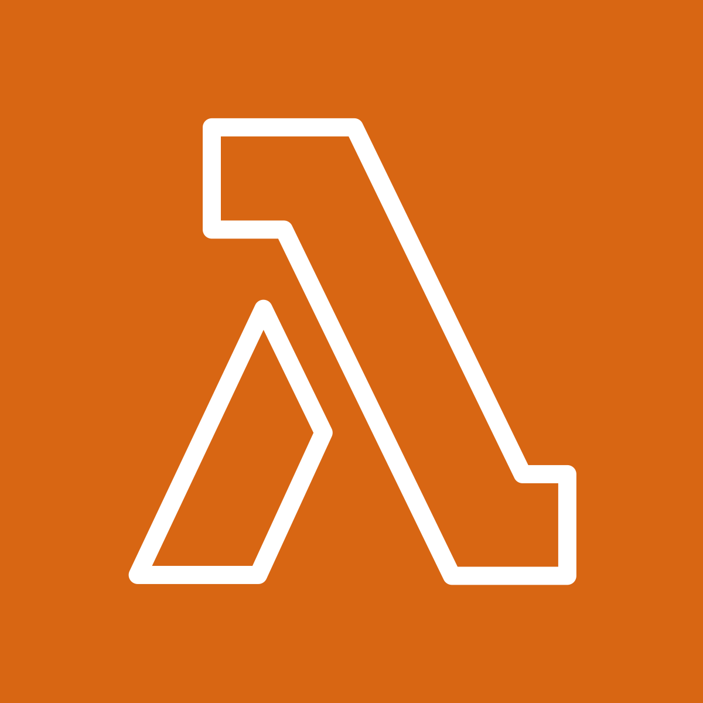

# DESAFIO BGC - BRASIL

O desafio consiste em criar um sistema que retorne os três primeiros produtos de cada categoria da página de mais vendidos da Amazon (https://www.amazon.com.br/bestsellers) e disponibilize essas informações por meio de uma API. Para isso, será necessário implementar um web scraper (utilizando Puppeteer) que extraia os dados e preencha um banco de dados utilizado pela API.

# Sumário

- [Documentação](#documentação)
- [Ferramentas Utilizadas](#ferramentas-utilizadas)
- [Implementação](#implementação)
- [Compilação e Execução](#compilação-e-execução)
- [Contatos](#contatos)

# Documentação

Segue abaixo alguns links que podem ser úteis para compreensão da tarefa:

- [Diário de Bordo](https://docs.google.com/document/d/1eEM56RRZlDFTrcXQE7txQXtcWO5pzMAcksMEC3rvrUc/edit?usp=sharing)
- [Comandos Úteis](https://docs.google.com/document/d/1CZrg0useXKoIFeijGeDK3NSPSFtjZqvzzm9dakc9J_U/edit?usp=sharing)
- [Documentação da API](#)

# Ferramentas Utilizadas

  
  
  
  

A pedido da BGC, foi utilizado o `Node.js/TypeScript` para o desenvolvimento do back-end, junto com as ferramentas disponibilizadas pela AWS, como o `DynamoDB` para a persistência dos dados, `Lambda` para a execução da função de busca de categorias e o `API Gateway` para a comunicação das APIs. O `Serverless Framework` também foi utilizado para a automação do processo de deploy.

# Implementação

A implementação foi realizada utilizando o Node.js/TypeScript para o desenvolvimento do back-end. O sistema foi responsável por fazer o scraping da página de bestsellers da Amazon utilizando o Puppeteer.

O processo de implementação inclui as seguintes etapas:

1. **Extração de Categorias**: A primeira função do scraper é extrair todas as categorias presentes na página de bestsellers da Amazon, como, por exemplo, "Games e Consoles". 
   
2. **Escolha da Categoria**: Após mapear as categorias disponíveis, o usuário pode escolher uma das opções por meio de uma entrada numérica. Essa escolha define qual categoria será processada em seguida.

3. **Scraping dos Produtos**: Após a seleção da categoria, o Puppeteer faz o scraping novamente para extrair os dados dos três primeiros produtos mais vendidos dessa categoria. As informações extraídas incluem:
   - Nome do produto
   - Link do produto
   - Ranking de vendas
   - Avaliação do produto
   - Preço do produto

4. **Armazenamento no DynamoDB**: Todos esses dados são então armazenados na tabela `ProdutosMaisVendidosPorCategoria` no DynamoDB para posterior consulta via API.

Essa implementação permite que o sistema capture e armazene dados atualizados sobre os produtos mais vendidos em diferentes categorias, tornando as informações facilmente acessíveis por meio da API.

# Compilação e Execução

Para executar o projeto localmente, utilize os seguintes comandos dentro da pasta que contém todos os arquivos do projeto:

| Comando                | Função                                                                                           |                    
| ---------------------- | ------------------------------------------------------------------------------------------------- |
| `npm start`            | Compila e executa todos os arquivos necessários, iniciando o servidor local para testar a aplicação. |
| `serverless deploy`    | Realiza o deploy do projeto utilizando o Serverless Framework, configurando e enviando os recursos para a AWS. |
| `serverless info`      | Exibe informações sobre o deploy, como o endpoint da API e outros detalhes relacionados à configuração do projeto na AWS. |

Certifique-se de ter todas as dependências instaladas antes de executar os comandos, utilizando o `npm install` para garantir que todas as bibliotecas estejam corretamente configuradas.

Após o deploy ou execução local, você pode acessar a API diretamente pelo navegador. Ao fazer isso, é necessário passar o parâmetro `categoryId` (sem acentuação) para realizar a solicitação corretamente.

# Contatos
<a>
✉️ <i>lucaslimadeoliveira80@gmail.com</i> 
</a>